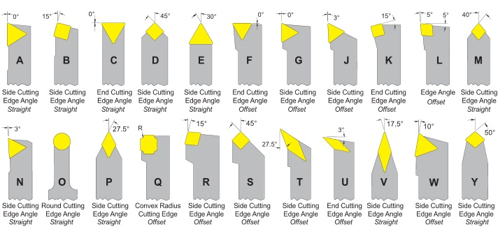
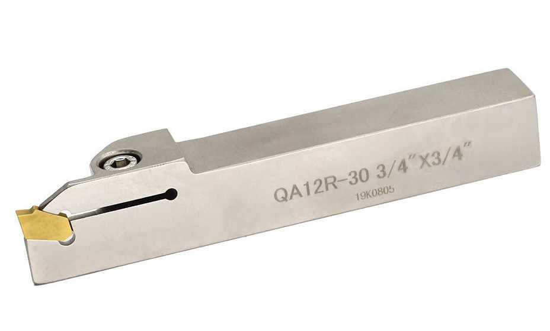
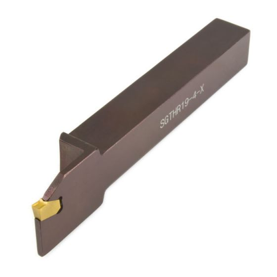
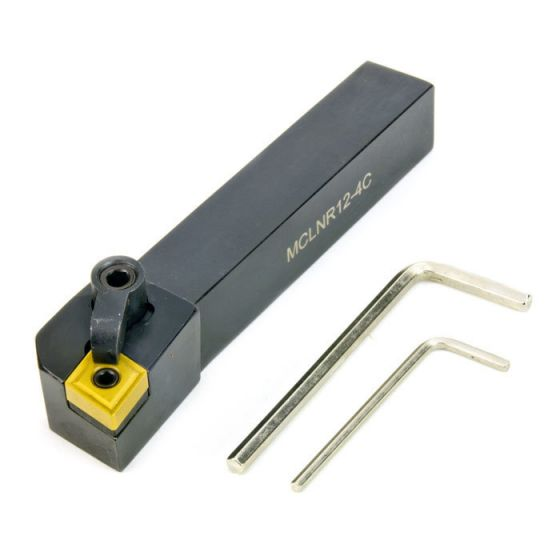
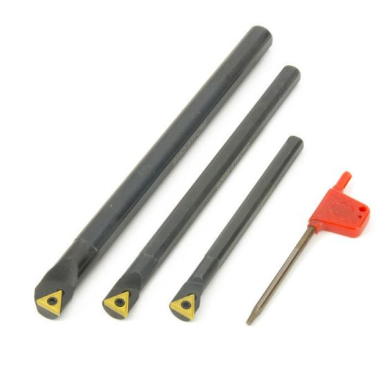

## Various Lathe Tools

[Source](http://mechanicstips.blogspot.com/2016/04/turning-tool-holder-system.html)

## Tools we have

### Parting/Grooving Tool

[Source](https://www.amazon.com/OSCARBIDE-Indexable-Grooving-Parting-QA12R-30/dp/B07WBWTJQX)

### RH Parting/Grooving Tool

[Source](https://tormach.com/rh-grooving-tool-sgthr-19-4-33347.html)

### RH Turning/Facing Tool

[Source](https://tormach.com/rh-turning-facing-tool-mclnr-12-4c-33130.html)

### Boring Bar Set

[Source](https://tormach.com/3-piece-stfcr-boring-bar-set-33142.html)

All possible tools

