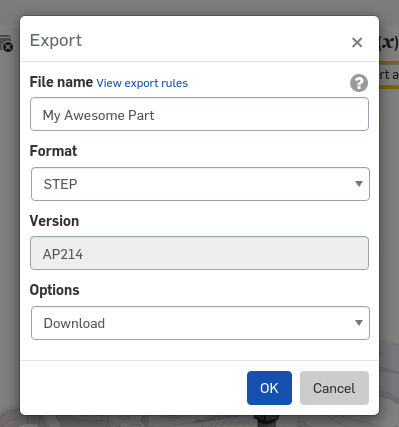
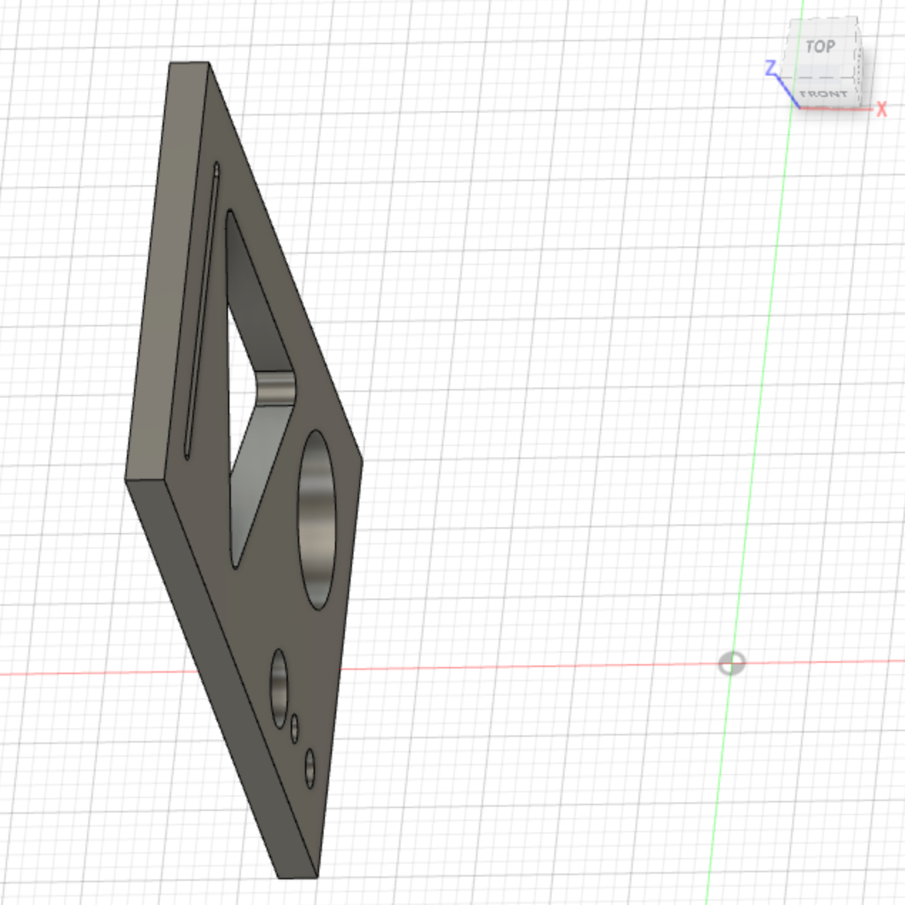
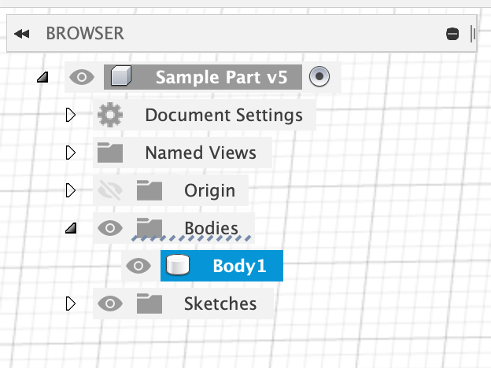
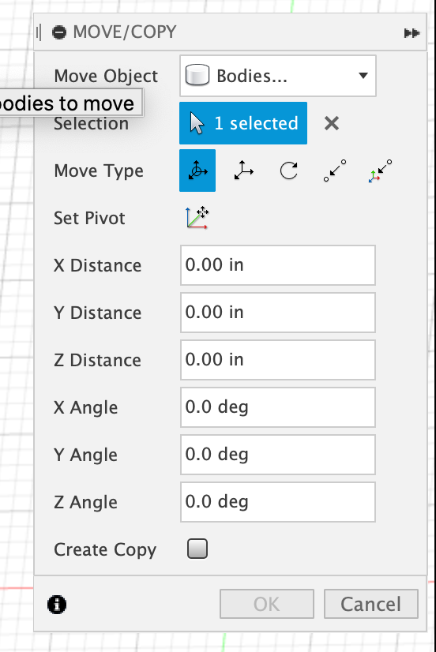
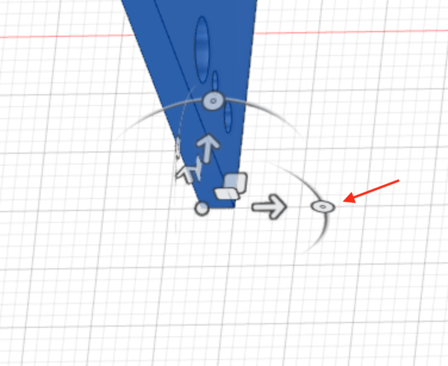
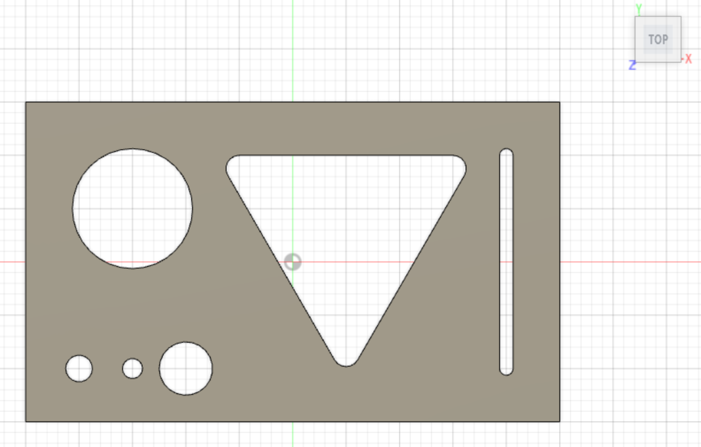
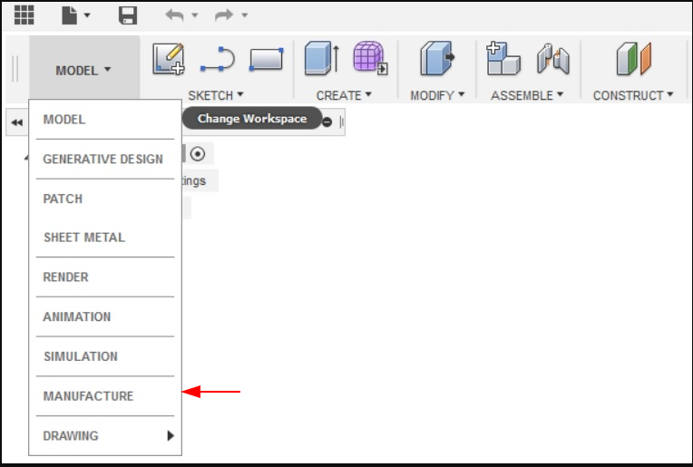

This is a brief introduction/refresher for creating GCODE via Fusion 360 CAM. This guide assumes CAM is targeted at the Velox using Mach3 as the GCODE sender.

1. Download a STEP file of the part from Onshape 


<---> <!-- separator between columns -->




2. Open the file in Fusion 360 
- [How to import or open a file in Autodesk Fusion 360](https://knowledge.autodesk.com/support/fusion-360/learn-explore/caas/sfdcarticles/sfdcarticles/How-to-import-or-open-a-file-in-Autodesk-Fusion-360.html)

3. Be sure the part is laying down with the correct face up. We have had the most success when the part top face matches Fusion's Top orientation. For some parts it will not matter which face is up. 

1. Locate the part in the browser under the Bodies section. Select the part by clicking on it once 
2. Open the Move/Copy dialog by pressing the 'm' key on your keyboard 
3. Be sure that **Bodies...** is selected in the **Move Object** dropdown 
4. Use the handles to move/roate the part 
5. Click OK when complete. Part should look like this. Notice the orientation of the part and the view cube. 


4. Change to the Manufacturing workspace 

5. Create a Setup which defines what your stock material shape and size are. test
    1. Tab 1: Set the zero axis to the bottom left corner of the stock so the red and green arrows point into the stock. It is critically important that the point selected is used as the zero poing when setting up the machine. 


<--->


   
    2.  Measure the actual z height of your stock using calipers. (Incorrect z will cut into the table.) 
    3. Tab 2: Make sure the top of the part is aligned with the top of the stock in the setup. (This is especially important if your model is a different thickness than your stock.) 
    4. Tab 3: If machining tubes set the WCS (work coordinate system) to 6 to indicate the vises that are setup on our Velox. (WCS6 is pre-configured in the Mach3 software on the PC connected to the Velox.) 
    
6. Now that the setup is done, you can create operations to make your part.
    1. If you haven't already import the CAM templates. <a href="" target="__blank">Here's How</a>
    2. Next, See <a href="" target="__blank">How to Use the CAM templates</a>

