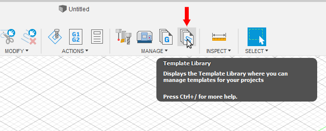
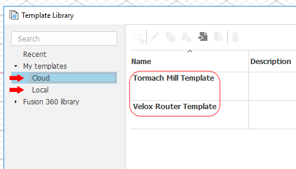

This is a short guide to importing CAM templates into Fusion 360 for CAM.

1. Download our custom CAM Templates
 - [Tormach Mill Template](Tormach-Mill-Template.f3dhsm-template)
 - [Velox Router Template](Velox-Router-Template.f3dhsm-template)
2. Switch to the Manufacture workspace

3. Open the Template Library

4. Check both Local and Cloud to see if you already have the templates

5. If the templates are missing. Click the import button.

6. Select the template(s) from your downloads folder, click Open.

Done!
