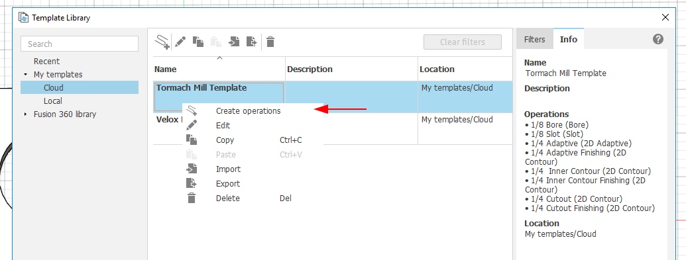
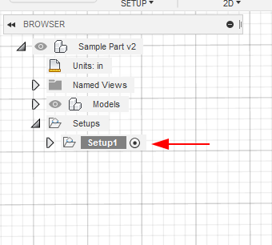
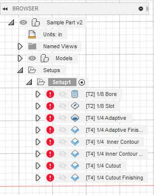
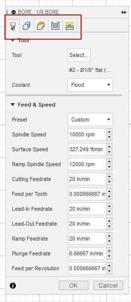
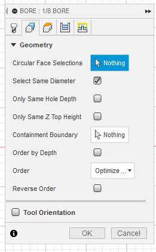
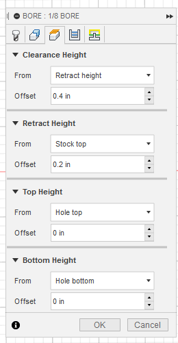
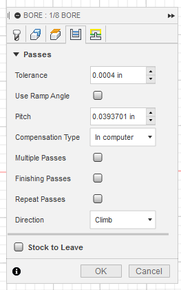
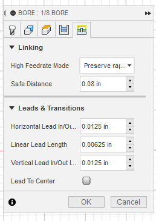
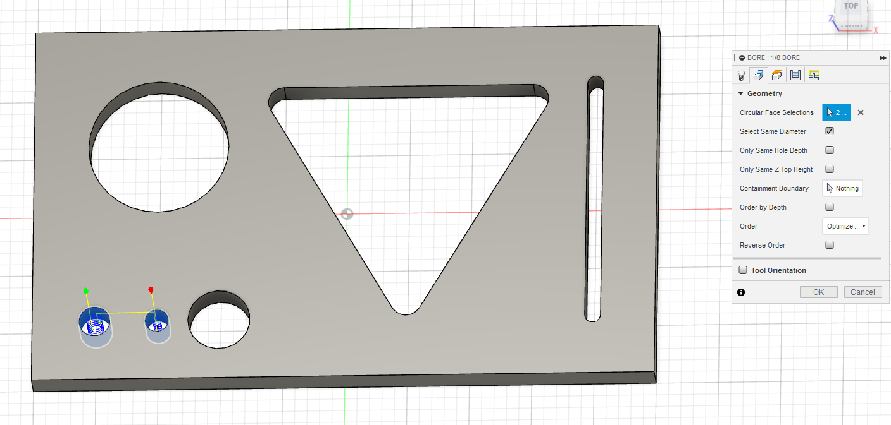

{}
**NOTE:** This guide assumes you have already completed [Intro to CAM]() and [Import CAM Templates]()
{}

{}
**NOTE:** Do the most challenging operations first. That way if something goes wrong, you won't have invested as much time in your new piece of scrap.
{}

1. Once your part is loaded into Fusion, and your setup is complete, [see Intro to CAM]() we can define how to make our part. For the purposes of this guide we will be making this sample part:

2. From the manufacture workspace, open Template Library.
3. Right click, choose "Create Operations" for either the Tormach Mill Template or the Velox Router Template

4. Close the Template Library
5. In the browser, Expand the Setup you previously created to see the operations.


<--->


Operation                   | Description
----------------------------|--
1/8 Bore                    | For holes smaller than 3/8" (.375")
1/8 Slot                    | For slots 1/8" (.125") to 1/4" (.25")
1/4 Adaptive                | For large area removal
1/4 Adaptive Finishing      | Required if Adaptive used, as adaptive is a roughing operation
1/4 Inner Contour           | TBD
1/4 Inner Contour Finishing | TBD
1/4 Cutout                  | Finally, liberate the part.
1/4 Cutout Finishing        | Optional, may make the edge of the part nicer.
6. Now we need to select the geometry for each of the operations. Start at the top and work towards the bottom. You can delete operations you do not need. Right Click "1/8 Bore" and choose Edit
7. In the operation edit pane, there are tons of settings, spread across 5 tabs. luckily we only need to focus on the Geometry tab as the template has good defaults for all the other settings.


<--->

<--->

<--->

<--->


8. In the Geometry tab we need to select all the circular faces of holes that are less than 3/8" (.375")

9. TODO

<!--
- Do small holes first, using a 2D bore using an 1/8" (.125") or 3/16" (.188") endmill.
- Next do any larger holes or lightening with a 1/4" (.250") endmill. These will require two operations, first an adaptive clear to quickly rough out the hole, then a 2D contour to cleanup
- Finally use a 2d countour to cut out your part. This requires a much slower cut. We often find creating a "virtual moat" and using an adaptive clear is a faster operation.
--!>
