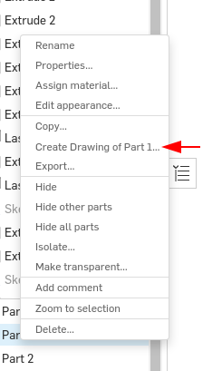
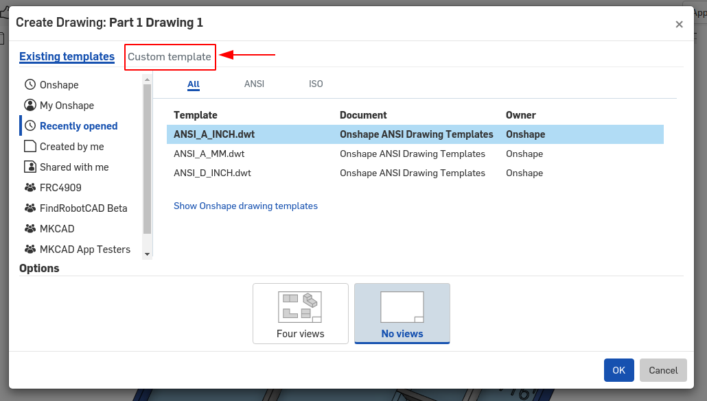
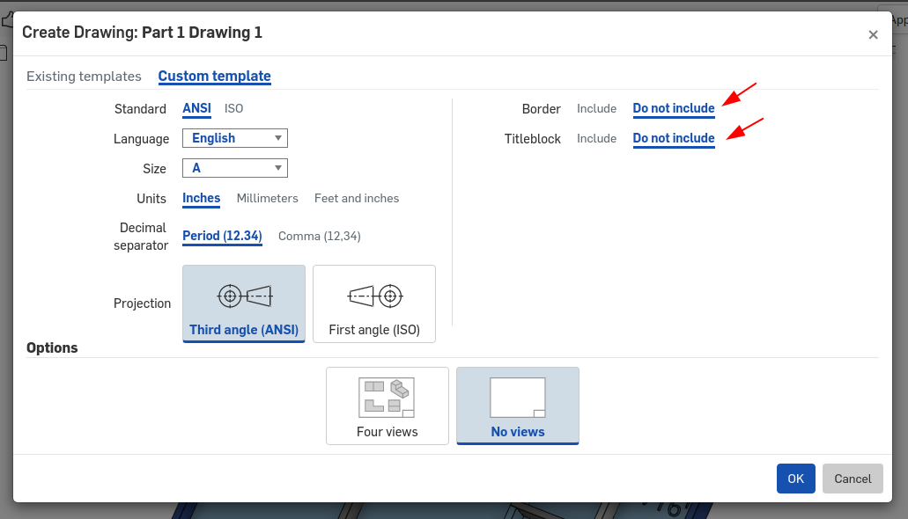
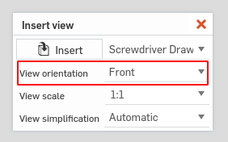
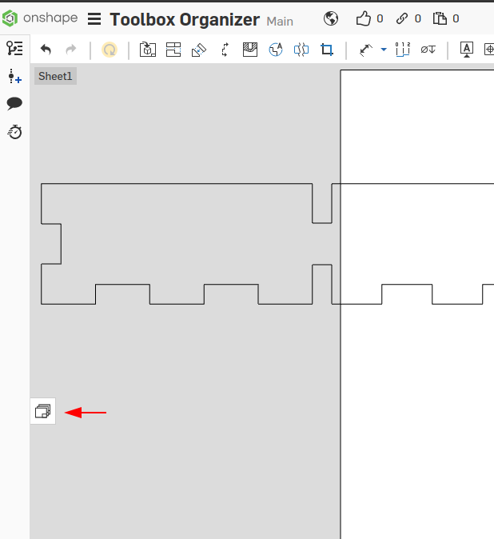
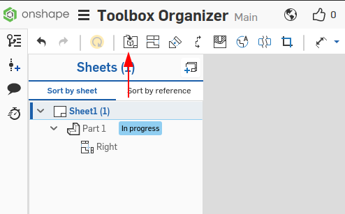
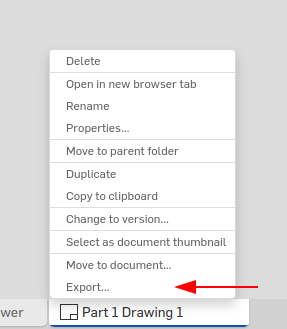
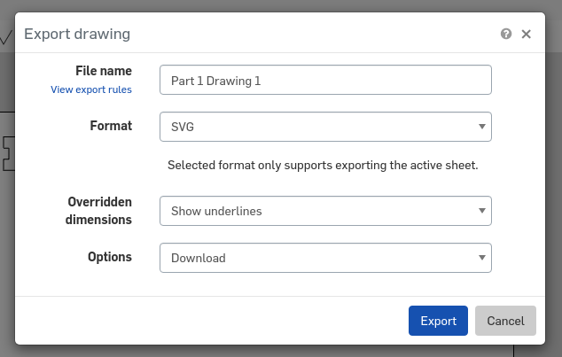
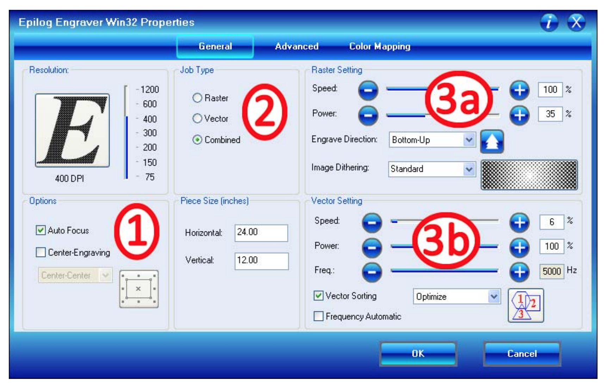

We often design prototypes, in OnShape, that can quickly be cut out of 1/4" plywood on the laser cutters.

Our laser cutters have a maximum working area of 24" by 18"

## Instructions

### Design and Export
1. Design the prototype in OnShape
2. Create a drawing without a border nor titleblock 

1. Right click on any part in the parts list, choose **Create Drawing** 
2. Choose Custom Template 
3. Choose "Do not include" for both **Border** and **Titleblock**, click **Ok** 
4. In the Insert view dialog make sure the **View scale is 1:1**
5. You may need to change the View orientation to see the side of the part for cutting 
6. Click to place the part anywhere on the drawing sheet (we can move it later)
7. OnShape assumes we want to have projected views. We do not need to place projected views, press escape to cancel the projected view.


3. Be make sure our drawing size matches our stock size. 
1. Open the Sheets pane 
2. Right click the sheet (probably **Sheet1**) and choose **Properties**
3. In the Sheet properties dialog, change the Size to custom
4. Set the width and height to match your stock. Usually to **24 in** wide and **18 in** in height


4. Additional parts can be added to the sheet with the **Insert View** tool 
1. Click the **Insert View** tool 
2. In the Insert view dialog click the Insert button
3. Choose another part
4. Be sure the View scale is **1:1**
5. You may need to change the view orientation
6. Click to place
7. OnShape assumes we want to have projected views. We do not need to place projected views, press escape to cancel the projected view.
8. Repeat these steps for each unique part


5. If you need more space, additional sheets can be created.
    1. From the sheets pane, click the add sheet button.
6. By this point you should have all the parts on various sheets. Export each sheet to SVG. 
1. Change to the first sheet
2. Right click on the drawing tab at the bottom, choose **Export...** 
3. Set the format to **SVG**, Click Export 
4. Repeat for each sheet


### Preparing the file

The laser will Cut any line that is exactly .001" wide, all others are engraved.

{}
Thick lines will be etched or engraved (it will use the "raster" settings on the laser). If you make a line 0.001 inches thick it will be cut out (it will use the "vector" settings on laser).
{}

{}
NEVER APPLY ANY OPACITY OR ALPHA CHANGES IF YOU WANT TO VECTOR CUT!!
Leave Opacity at 100% and A at 225.
{}

1. Use the **Fill and Stroke...**(Shift-Ctrl-F) dialog to change the width of any lines that need to be cut.

2. The **Objects...** menu can be of use to see how the parts of your drawing are grouped.

3. **Leave space around your part**, cutting to the edge of the stock is not recommended. If the stock isn't perfectly in the machine your part will have a misshapen edge.

4. Save your file for printing on the laser by making it a PDF. We have found that the laser requires a program which outputs proper postscript to accurately make the distinction between vector and raster. Printing from Inkscape does not seem to work. However Adobe products such as Acrobat Reader and Illustrator work well. 

{}
The following steps assume you are on a computer connected to the laser
{}

### Set Cutting and Engraving speeds

5. Consult the [Laser Material Settings](/equipment/cnc/epilog-helix-laser/laser-material-settings.pdf) or the abbreviated table below for our 60W, CO2 Laser determine your power, speed and frequency/DPI for your material. {}

6. Open the PDF with Adobe Acrobat Reader
7. File > Print
8. Select the Epilog Laser from the list of printers
9. Click Properties to open the laser configuration window

    - 1 - Be sure **Auto Focus** is selected
    - 2 - **Combined** is sufficient unless you want to be sure to only do one type of operation
    - 3a - Set the Speed and Power for the **Raster** (Engrave) operation
    - 3b - Set the Speed, Power and Frequency for the **Vector** (Cut) operation
    - Click OK

### Power on, Load Material and Cut/Engrave
10. Turn On the Laser, Air Assist and Fume Extraction
    1. Laser Power: Switch on Left side
    2. Air Assist: Switch on compressor pump 
    3. Fume Extraction: Time Dial on wall (takes ~30 secs to start)

11. Place your material in the upper left of the laser engraver bed

{}
You should hear loud hissing and fan whirring sounds! If not: Stop and ask for help!
{}

12. Make sure your project looks correct on the print preview
13. Click Print, and that your job name should appear on the laser display
14. To start, push the green print button on the laser 

{}
STAY NEXT TO THE LASER WHILE PRINTING!
{}

Done!

## Material Notes
When cutting wood, multiple passes may allow cutting of thicker materials. Using Color Mapping you can adjust the focus point between passes down to the
center point of the cut for the best results.

When cutting acrylic, adjusting the standard focus distance so it is closer to the lens by about .080” (2 mm) will produce better edge quality when cutting 1/4” (3mm) acrylic and thicker. Two passes can be used for cutting thicker materials. 

There are two types of acrylic: cast is better for engraving (it creates a frosted look when engraved) and extruded acrylic produces a much better flame polished edge. 

    

Based on the fantastic Inkscape tutorial from the Tulane makerspace
http://makerspace.tulane.edu/Uploads/InkscapeTutorial.pdf