Based on the inspiration of the [Killer Bees Battery Cart](https://www.chiefdelphi.com/t/killer-bees-frc-battery-cart/389013) we designed and built a wheeled parts storage cart.

This guide provides build instructions for making your very own parts organizer rack for your robotics team. This design is made of plywood, properly gluing all joints is critically important.

The organizer has space for 17 shallow organizers or 8 deep organizers and 1 shallow. Depending on how part are organized parts one can mix and match small and large organizers.

Drawings are [available for Download](part_bin_organizer_rack.pdf)


<--->
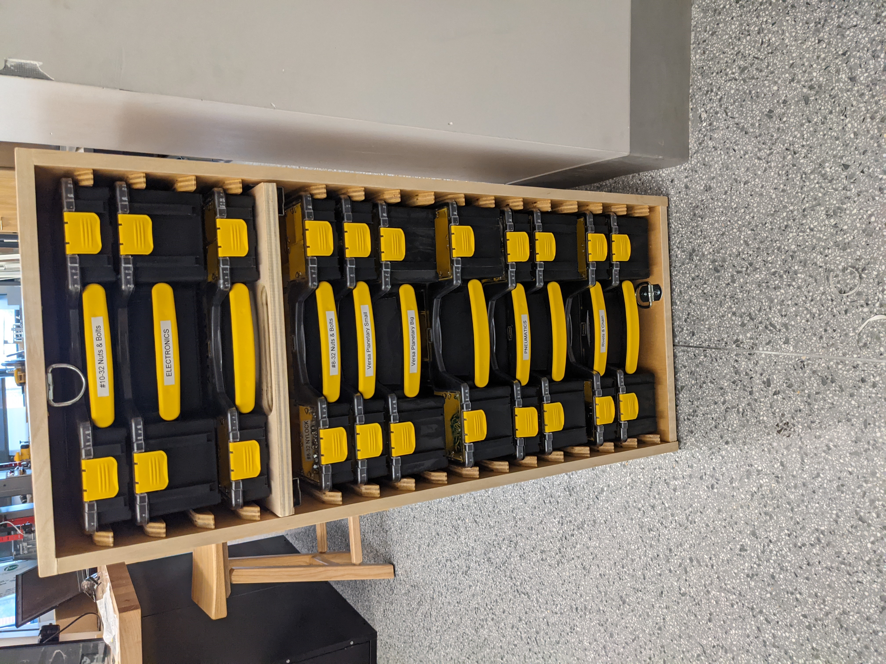

## A few comments on materials:
- We used 5 ply, Sande plywood from Home Depot. The Killer Bees recommend using 7 ply 3⁄4" Birch Plywood for this build. The
flatness and strength of furniture grade plywood is superior to
construction grade materials
- We recommend the Colson wheels we have listed below. These
are virtually indestructible in this high load application.
- Use a steel axle, not aluminum.
- Proper gluing of all joints is critically important.

## Materials List
Qty.    | Item                        | Source
--------|-----------------------------|----------
1       | 70" x 48" x 3/4" Plywood    | [Home Depot][1]
1       | 8' 2"x4" lumber (1.5"x3.5") | [Home Depot][2]
1       | 1/2" x 24"  Steel Rod       | [McMaster][3]
2       | 8" x 1.5" Colson Wheels     | [McMaster][4]
2       | 1/2" Axle Cap Nuts          | [McMaster][5]
1       | steel D-ring                | [McMaster][6]
~100    | 1-1/2" 15 Gage Nails        |
1       | Wood glue (Titebond II)     | [Home Depot][8]
1       | 24" Bungee Cord             | [Amazon][9]
17.5"   | 1-1/4" Dowel Rod            | [Home Depot][10]
_       | Deep Pro Organizer          | [Home Depot][11]
_       | Shallow Pro Organizer       | [Home Depot][12]
6       | Rubber Bumpon (Came in KOP) | [Image][13]
~24     | 1 5/8" Screws               |
1 Quart | Paint or Polyurethane       |

[1]: https://www.homedepot.com/p/18mm-Sande-Plywood-3-4-in-Category-x-4-ft-x-8-ft-Actual-0-709-in-x-48-in-x-96-in-454559/203414066
[2]: https://www.homedepot.com/p/2-in-x-4-in-x-96-in-Prime-Whitewood-Stud-058449/312528776
[3]: https://www.mcmaster.com/3076T34/
[4]: https://www.mcmaster.com/2829t423
[5]: https://www.mcmaster.com/94803A050/
[6]: https://www.mcmaster.com/3076T34/
[7]: -
[8]: https://www.homedepot.com/p/Titebond-8-oz-Titebond-II-Ultimate-Wood-Glue-5003/202180087
[9]: https://www.amazon.com/Keeper-06119-Adjustable-Flat-Bungee/dp/B0044FPNIG
[10]: https://www.homedepot.com/p/6420U-1-1-4-in-x-1-1-4-in-x-48-in-Hardwood-Round-Dowel-10001811/203334072
[11]: https://www.homedepot.com/p/Stanley-10-Compartment-Deep-Pro-Small-Parts-Organizer-014710R/100375900
[12]: https://www.homedepot.com/p/Stanley-25-Compartment-Shallow-Pro-Small-Parts-Organizer-014725R/203707065
[13]: 0002136_bumpons-sheet-of-24-sj5009-70070079754_300.jpeg

## Tools 
List of tools needed.
- Circular Saw or Table Saw
- Hand Drill or Drill Press
- Drill / Driver with #2 Bit
- Router or Router table with 1⁄4” Round-over bit
- Jigsaw
- Hacksaw or Cutoff Wheel
- Air Nailer (15 gauge)
- Sanding block / Sander
- Forstner bits 7⁄8", 1-1/4"
- Countersink bit
- Clamps
- Hammer
- Wood Glue Spreader
- 1.5" Paint Brush

## Prepare Parts
Start by preparing all the pieces. 

### Cut Sheet
We provide a cut sheet below to help plan your cuts.
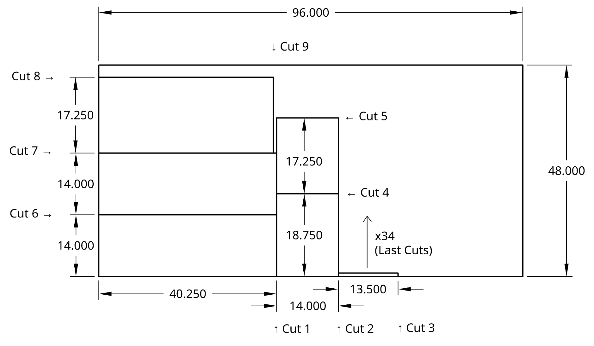

### Other Parts
These few parts are also needed:
1. Axle Holder - Made from 2x4
2. Left Handle Holder - Made from 2x4
3. Right Handle Holder - Made from 2x4
4. Handle - Made from the 1.25" dowel

### Spacers
To make assembly of the sliders much easier we recommend fabricating two spacers. The "Base Spacer" is used for the first slider, the other "Spacer" is to be used for all the other sliders.

We assembled the stoppers to the spacers with nails and, were careful to ensure the stoppers were square to the spacer body.

We found it is easy for error to stack up. Be careful when using the spacer to align the back of the spacer with the edge of the base.

## Instructions

### 1. Use "Base Spacer" to install first slider
Attach with glue and 16 gage 1 1/4" nails.
Align spacer (shown in green) to bottom edge and back edge.
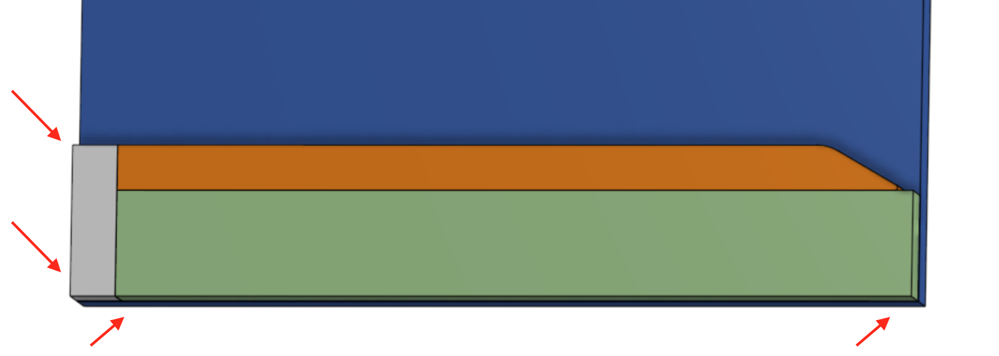

### 2. Use the "Spacer" jig to install 16 more sliders
Align spacer (shown in gray) to previous slider and back edge.
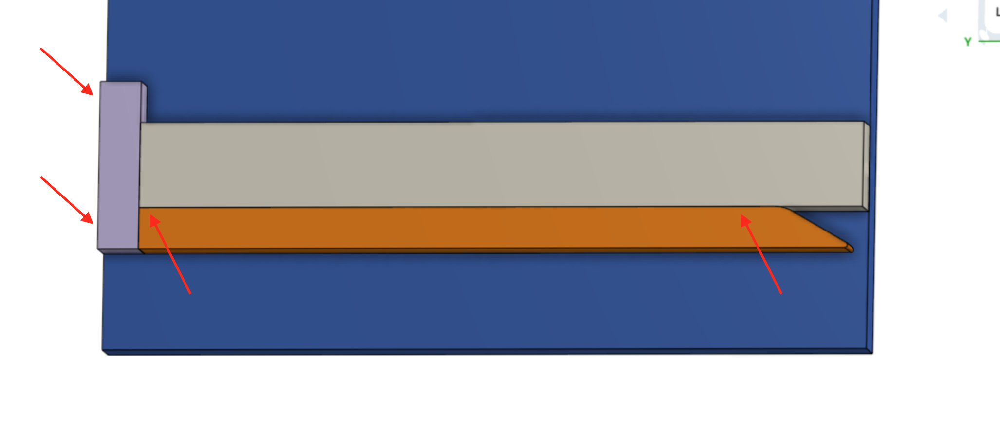

### 3. Repeat steps 1 and 2 for the other side

### 4. Check slider placement
Place left and right assemblies face to face to ensure that all spacers are aligned properly before proceeding

### 5. Frame Assembly: Assemble Bottom to Back
Glue and nail from the bottom
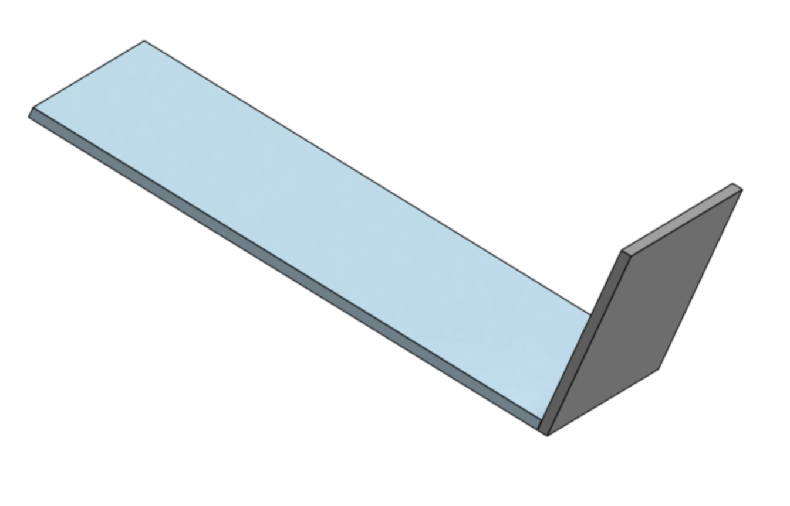

### 6. Assemble Right to Back and Bottom
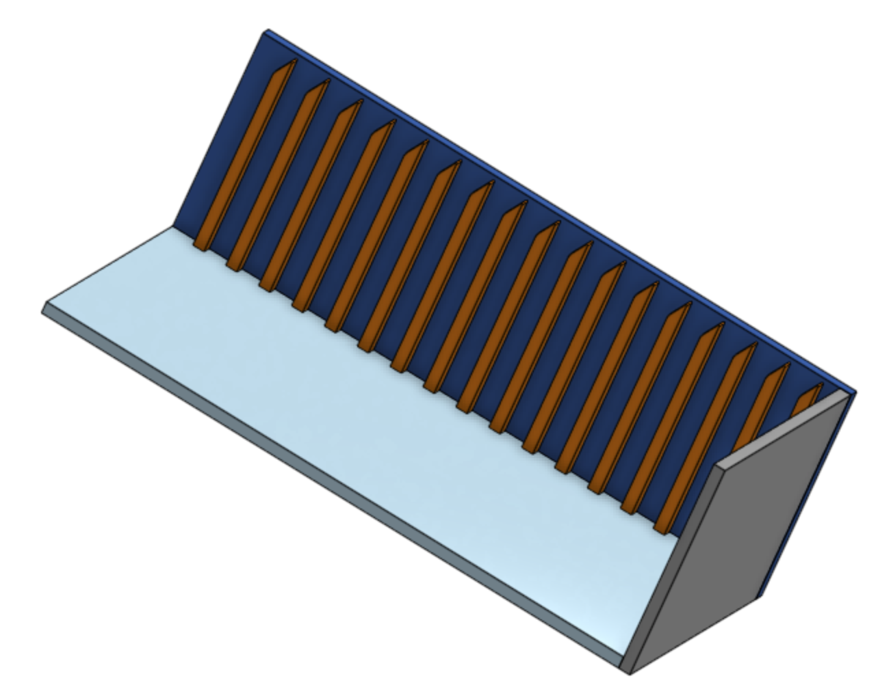

### 7. Assemble Left to Back and Bottom
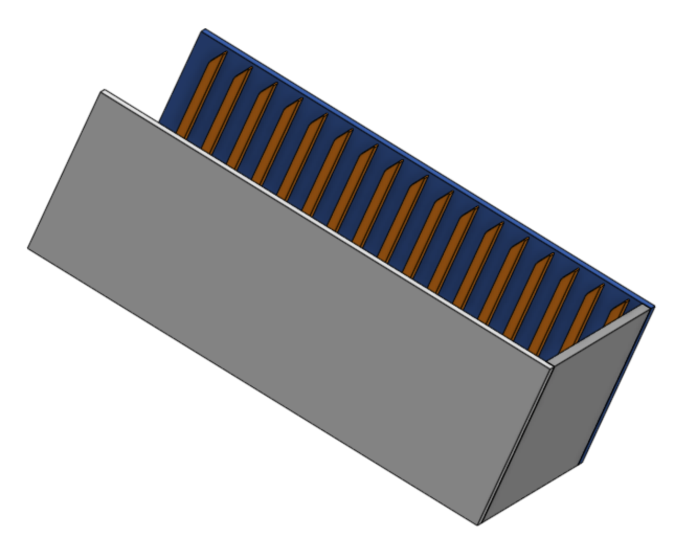

### 8. Assemble Top to Back, Left and Right
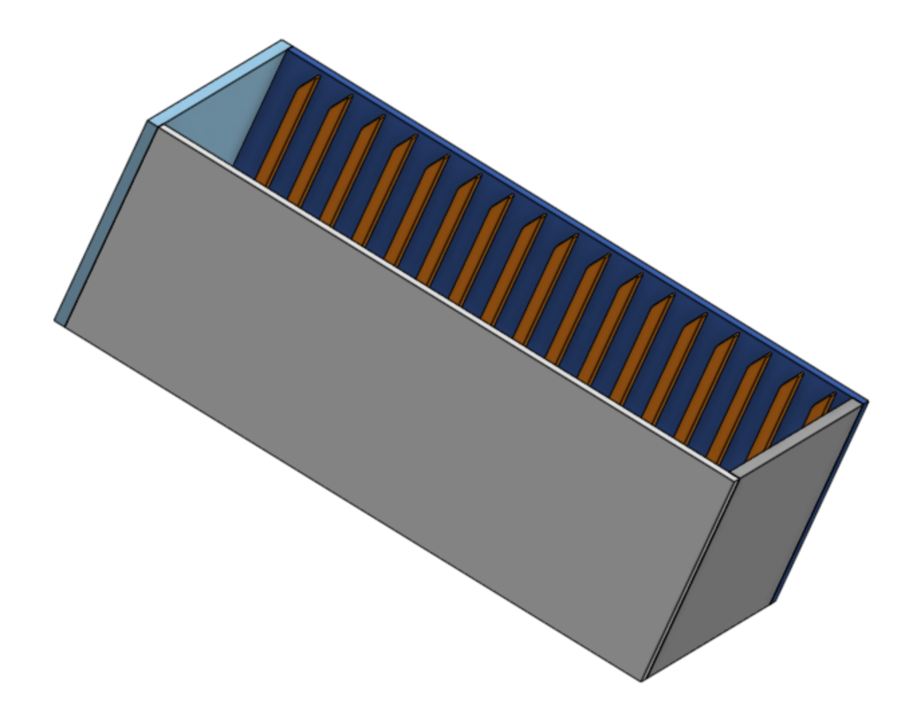

### 9. Assemble Axle blocks to frame
Install axle before attaching the blocks. Glue well as these are load bearing. Add 1 5/8" screws from the inside to attach the blocks. Align the blocks to the bottom edge of the frame. Note the blocks are intentionally 7.5" tall to account for the rubber feet to be attached to the bottom of the frame. Don't put the wheels on yet so we can give the glue time to dry.
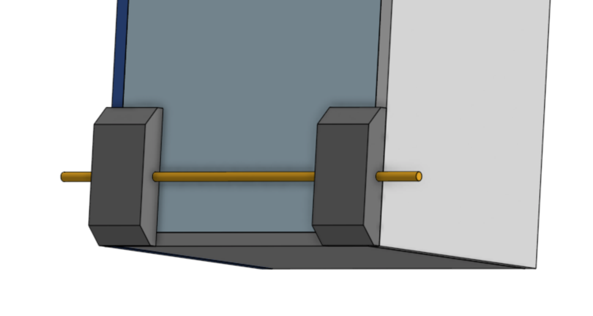

### 10. Install the handle into the handle holder blocks
Use glue and twist the handle into the holes it should be a tight fit. Use a flat surface to square up the blocks.
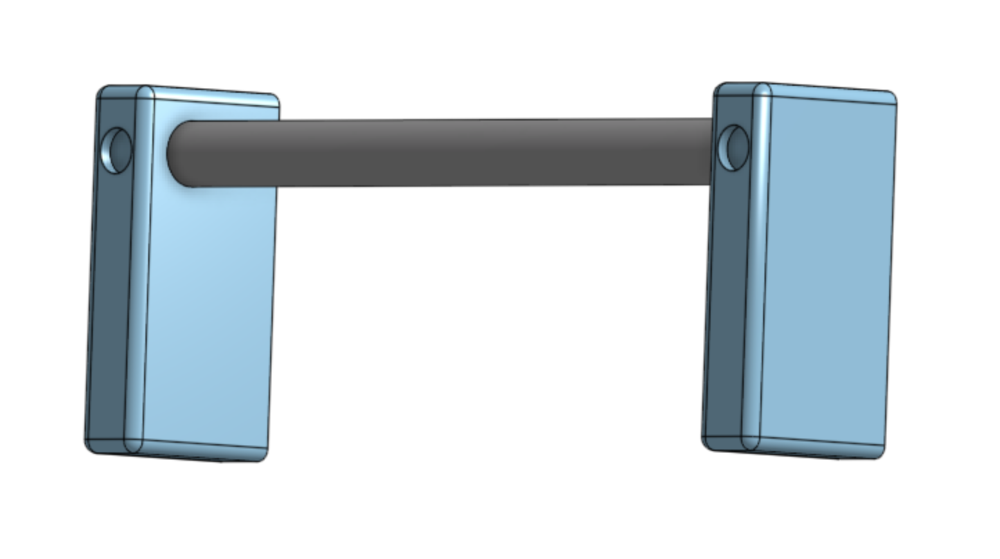

### 11. Attach the Handle assembly to the frame
With the help of a friend, use glue and screws to attach the handle assembly. Align to the top.
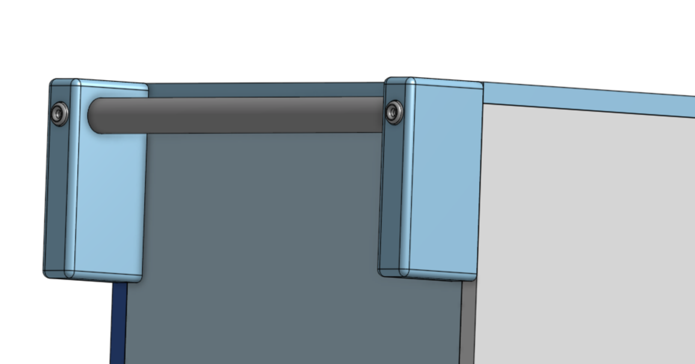

### 12. Time to Paint! (or apply the chosen finish)
At this stage is a good time to apply finish before the rest of the parts are installed.

### 13. Install wheels. Hammer on cap nuts.
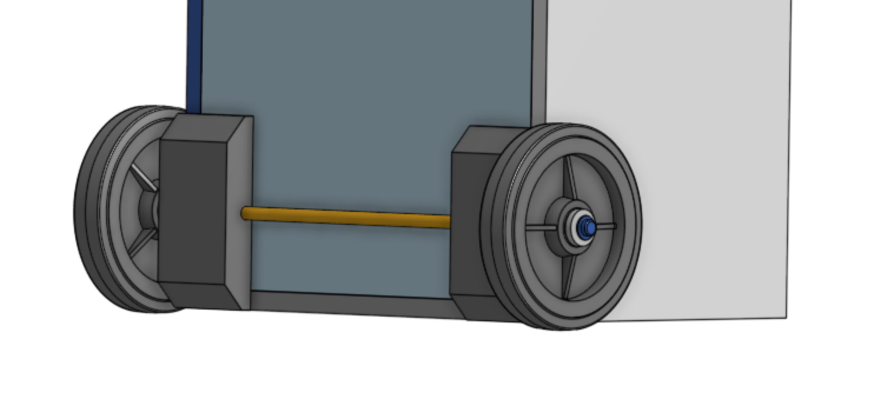

### 14. Install (6) rubber bumpon feet
Use a #8 washer and a 1/2" screw to attach.

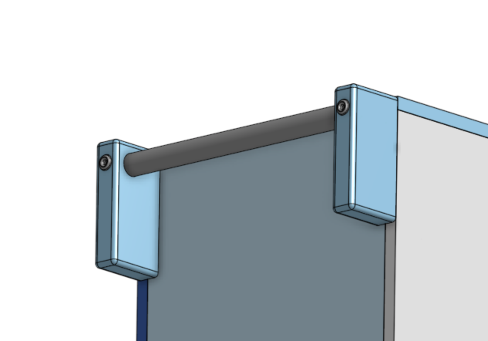
<--->
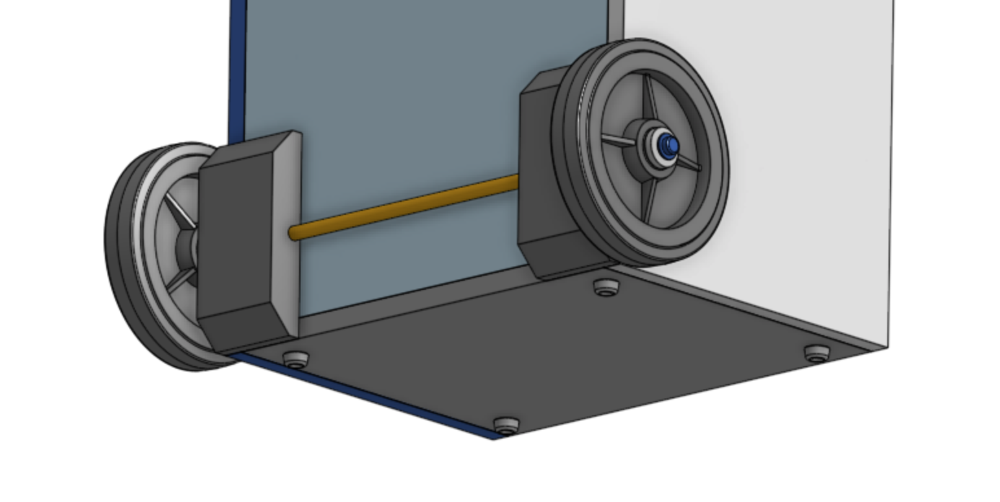


### 15. Install tie down rings to the top and bottom

### 16. Fill with organizers, install bungee

### 17. Project Completed!
Good Luck Teams!