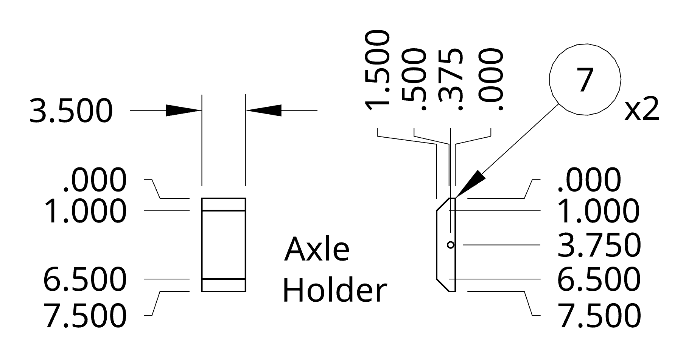
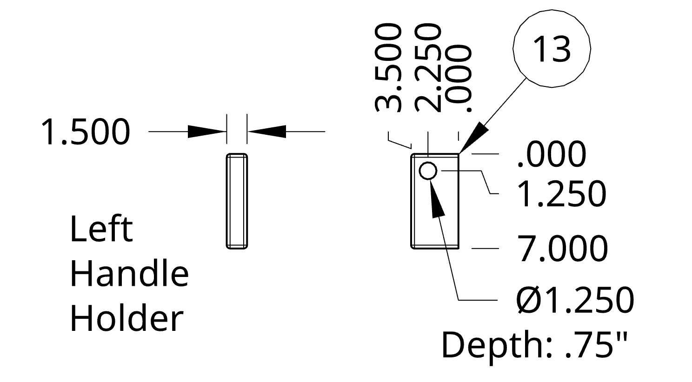
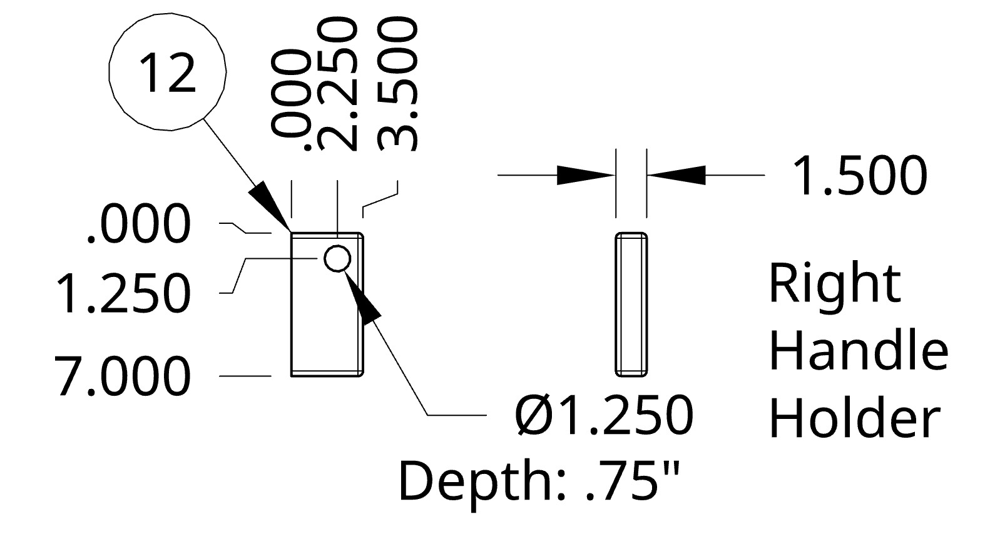
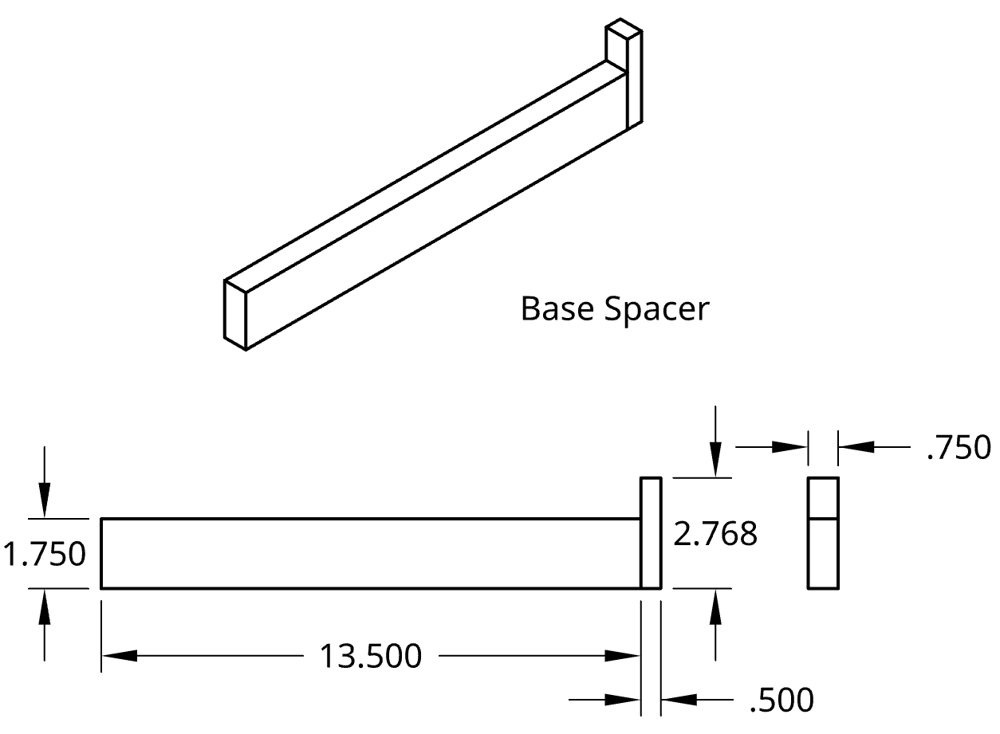
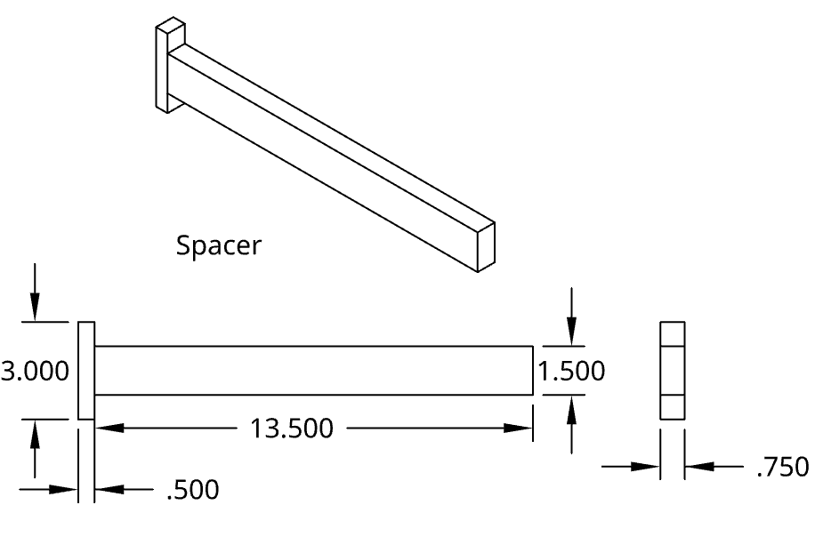

Based on the inspiration of the [Killer Bees Battery Cart](https://www.chiefdelphi.com/t/killer-bees-frc-battery-cart/389013) we designed and built a wheeled parts storage cart.

This guide provides step-by-step build instructions for making your very own parts organizer rack for your robotics team. This design is made of plywood.

Drawings are [available for Download](part_bin_organizer_rack.pdf)


<--->


## A few comments on materials:
- We used 5 ply, Sande plywood from Home Depot. The Killer Bees recommend using 7 ply 3⁄4" Birch Plywood for this build. The
flatness and strength of furniture grade plywood is superior to
construction grade materials
- We recommend the Colson wheels we have listed below. These
are virtually indestructible in this high load application.
- Use a steel axle, not aluminum.
- Proper gluing of all joints is critically important.

## Materials List
Qty.    | Item                        | Source
--------|-----------------------------|----------
1       | 70" x 48" x 3/4" Plywood    | [Home Depot][1]
1       | 8' 2"x4" lumber (1.5"x3.5") | [Home Depot][2]
1       | 1/2" x 24"  Steel Rod       | [McMaster][3]
2       | 8" x 1.5" Colson Wheels     | [McMaster][4]
2       | 1/2" Axle Cap Nuts          | [McMaster][5]
1       | steel D-ring                | [McMaster][6]
~100    | 1-1/2" 15 Gage Nails        |
1       | Wood glue (Titebond II)     | [Home Depot][8]
1       | 24" Bungee Cord             | [Amazon][9]
17.5"   | 1-1/4" Dowel Rod            | [Home Depot][10]
        | Deep Pro Organizer          | [Home Depot][11]
        | Shallow Pro Organizer       | [Home Depot][12]
6       | Rubber Bumpon (Came in KOP) | [Image][13]
1 Quart | Paint or Polyurethane       |

[1]: https://www.homedepot.com/p/18mm-Sande-Plywood-3-4-in-Category-x-4-ft-x-8-ft-Actual-0-709-in-x-48-in-x-96-in-454559/203414066
[2]: https://www.homedepot.com/p/2-in-x-4-in-x-96-in-Prime-Whitewood-Stud-058449/312528776
[3]: https://www.mcmaster.com/3076T34/
[4]: https://www.mcmaster.com/2829t423
[5]: https://www.mcmaster.com/94803A050/
[6]: https://www.mcmaster.com/3076T34/
[7]: -
[8]: https://www.homedepot.com/p/Titebond-8-oz-Titebond-II-Ultimate-Wood-Glue-5003/202180087
[9]: https://www.amazon.com/Keeper-06119-Adjustable-Flat-Bungee/dp/B0044FPNIG
[10]: https://www.homedepot.com/p/6420U-1-1-4-in-x-1-1-4-in-x-48-in-Hardwood-Round-Dowel-10001811/203334072
[11]: https://www.homedepot.com/p/Stanley-10-Compartment-Deep-Pro-Small-Parts-Organizer-014710R/100375900
[12]: https://www.homedepot.com/p/Stanley-25-Compartment-Shallow-Pro-Small-Parts-Organizer-014725R/203707065
[13]: 0002136_bumpons-sheet-of-24-sj5009-70070079754_300.jpeg

## Tools 
List of tools needed.
- Circular Saw or Table Saw
- Hand Drill or Drill Press
- Drill / Driver with #2 Bit
- Router or Router table with 1⁄4” Round-over bit
- Jigsaw
- Hacksaw or Cutoff Wheel
- Air Nailer (15 gauge)
- Sanding block / Sander
- Forstner bits 3⁄4”, 1-1/4"
- Countersink bit
- Clamps
- Hammer
- Wood Glue Spreader
- 1.5" Paint Brush

## Instructions
Start by preparing all the pieces. 

### Cut Sheet
We provide a cut sheet below to help plan your cuts.

### Other Parts
These few parts are also needed.
1. 
2. 
3. 
4. 

### Spacers
To make assembly of the sliders much easier we recommend fabricating two spacers. The "Base Spacer" is used for the first slider, the other "Spacer" is to be used for all the other sliders.


<--->



<!--
### 1. Start with the bottom
We fount it is easy for error to stack up. We built a spacer template to align the sliders.

### 2. Build from the bottom up

### 3. Assemble Axle blocks to frame

### 4. Install wheels. Hammer on cap nuts.

### 5. Install  
--!>