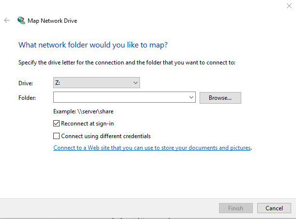
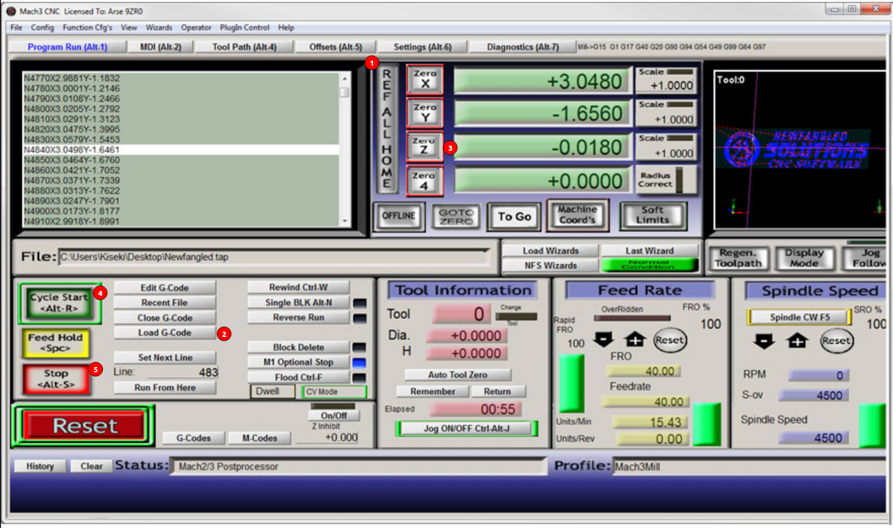

Once you have completed your CAM, it is time to make your part!

{}
**NOTE:** This guide assumes you have already completed [Intro to CAM]() and [Using our CAM Templates]()
{}

1. Turn on the Velox. There are three power buttons:
    1. Turn on the PC first (it takes the longest)
    2. Turn on the motor controllers
        - Location: switch on black box below PC
        - Flip switch to "I" controller box should light up
    3. Turn on the spindle VFD
        - Location: green button to the left of the PC screen
        - Be sure the Delta VFD screen lights up
2. Get your GCODE (.tap file) onto the Velox PC
    - Use a flash drive
    - Use the shared network folder:
        1. In Windows open File Explorer
        2. Check in "This PC" for a "Z:" drive called "gcode", if it exists jump to step 9
        3. Right click on "This PC"
        4. Choose "Map Network Drive"
        5. In the "Folder" field enter "\\\veloxrouter\gcode"
        6. Click finish
        7. When prompted for a username enter "cnc"
        8. Password is the same as our computers
        9. Now use your new folder to copy your .tap gcode file onto the Velox PC

3. Take the machine out of E-Stop
    - (Twist the big red button BE GENTLE)
4. Open Mach3 (Icon on the desktop)
5. Click the Reset button

6. Click "REF ALL HOME" (This may take a minute as the machine clicks each limit switch)
7. Load the gcode you made in Fusion using the "Load G-Code" button
8. Put the first tool in the machine, use the arrow keys on your keyboard to drive the tool over your stock.
9. Once the tool is over the stock, the bit setter can be placed on the stock.
10. Once the bit setter is placed click the "Auto Tool Zero" to set the stock top height zero. (May need to press the button)
11. We should now be set up to run the GCODE.
{}
Before starting the run **be prepared to cancel the run with the stop button**
{}

12. If the machine does any of these:
    - Makes any skipping sounds
    - Stops in the middle of the run
    - Crashes into anything (vises, parts, screws, other parts of the machine)
**YOU MUST re-home the machine with "Ref All Home" and reset your z offset. (go to Step 63)**    
Don't hesitate to ask for help.
 
13. If you click stop or reset:    
**YOU MUST** re-home the machine with "Ref All Home" and reset your z offset. (go to Step 6)    
Don't hesitate to ask for help.

14. If you drive the machine into the hard stops or into the table:    
**YOU MUST** re-home the machine with "Ref All Home" and reset your z offset. (go to Step 6)    
Don't hesitate to ask for help.

15. If anything goes wrong:    
**YOU MUST** re-home the machine with "Ref All Home" and reset your z offset. (go to Step 3)
Don't hesitate to ask for help.

16. Click "Cycle Start"
{}
**Be prepared to cancel the run with the stop button**
{}  

**Other Notes:**
To use the Vises at the back of the machine for tube stock be sure to choose WCS 6 when doing your setup in Fusion 360.
